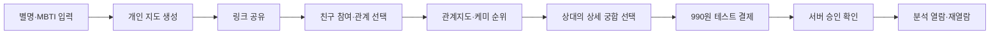
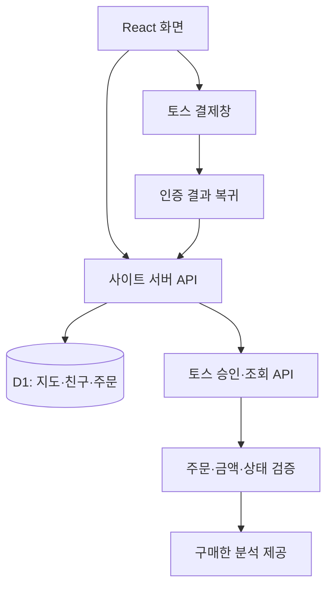

# SHYSTAR · 사이별

**MBTI 기반 관계지도를 생성·공유하고, 관계별 분석 콘텐츠와 단건 결제 기능까지 구현한 모바일 중심 풀스택 웹서비스**

별명과 MBTI로 나만의 지도를 만들고, 친구가 공유 링크로 참여하면 케미 점수와 순위가 갱신됩니다. 무료 지도에서 생긴 궁금증을 990원 단건 상세 분석으로 연결하는 MVP를 구현했습니다.

- [공개 서비스](https://shystar.greenmamos.workers.dev/)
- [상세 분석 샘플](https://shystar.greenmamos.workers.dev/analysis-sample)
- 프로젝트 형태: AI 보조 개발을 활용한 개인 풀스택 웹서비스 프로젝트
- 기록 기준: 2026년 9월 14일 작업 현황
- 운영 단계: 공개 MVP 및 테스트 결제 검증. 실제 대금 청구·매출 검증은 아직 진행하지 않았습니다.

## 1. 기획 배경

MBTI 설명을 한 번 읽고 나가는 흐름에서 벗어나, 친구가 참여할수록 자신의 관계지도가 달라지는 경험을 만들고자 했습니다. 별명과 유형만으로 참여하게 해 진입 절차를 줄이고, 지도·순위·관계별 콘텐츠를 연결했습니다.

서비스 가설은 **무료 지도 참여와 공유가 상세 분석에 대한 관심으로 이어질 수 있다**는 것입니다. 현재는 기능 구현과 테스트를 마쳤으며, 실제 유입·구매 전환율로 이 가설을 검증한 단계는 아닙니다.

## 2. 사용자 흐름



## 3. 주요 기능

| 기능 | 구현 내용 |
| --- | --- |
| 개인 관계지도 | 별명과 MBTI 입력으로 지도 생성, 고유 주소 발급 |
| 공유와 참여 | 공유 링크로 친구 등록, 별자리 형태의 관계 시각화 |
| 케미 점수·순위 | 유형별 규칙 기반 점수, 같은 점수는 같은 순위로 표시 |
| 관계 선택 | 친구·선후배·동료·지인·가족·연인·기타, 미선택 허용 |
| 관계 카테고리 | 같은 주파수·편안한 리듬·반짝 티키타카·새로운 시선·뜻밖의 모험 |
| 지도 관리 | 지도를 만든 브라우저에서 잘못 등록된 친구 삭제 |
| 상세 분석 | 136개 유형 조합별 사례와 관계별 문구를 결합한 긴 형식의 리포트 |
| 단건 결제 | 토스페이먼츠 테스트 환경에서 990원 결제·승인 확인 |
| 구매 내용 보관 | 구매 시점의 분석 저장, 구매자 쿠키를 통한 재열람 |

선택한 관계는 분석 문구에 반영하며 케미 점수에는 영향을 주지 않습니다. 점수와 분석은 자체 작성한 재미용 콘텐츠이며, 실제 관계를 예측하는 심리검사는 아닙니다.

## 4. 기술 구성

| 영역 | 사용 기술과 역할 |
| --- | --- |
| 화면 | React 19, TypeScript, 반응형 CSS, shadcn/Base UI |
| 애플리케이션 | Vinext, Vite, App Router 형식의 페이지·API 구성 |
| 실행·호스팅 | Sites, Cloudflare Workers 기반 실행 환경 |
| 데이터 | Cloudflare D1, Drizzle 스키마·마이그레이션, 매개변수화한 SQL |
| 결제 | 토스페이먼츠 V2 SDK 및 서버 결제 승인·조회 API |
| 검증 | Node.js 테스트 러너, 격리 SQLite·모의 결제사 테스트, 타입 검사, 빌드 |



## 5. 주요 설계와 문제 해결

### 서버 기반 결제 검증

결제 성공 URL로 구매 완료 상태 확인하였고, 추가로 서버에서 주문번호·결제 금액·paymentKey·결제 상태를 다시 검증한 후 콘텐츠 접근 권한을 부여했습니다.

### 응답이 끊긴 결제의 중복 처리 방지

승인 요청에 주문별 멱등성 키를 사용합니다. 승인 응답이 불명확하면 같은 결제를 조회하며, 새로운 주문을 만들어 다시 청구하지 않도록 구성했습니다. 실제 결제창 테스트에서 발견한 고객 식별자 길이 제한도 수정하고 회귀 테스트에 추가했습니다.

### 공유 지도와 구매 권한 분리

지도 주소는 친구에게 공유할 수 있지만, 주문 주소만 알아서는 구매한 본문을 읽을 수 없습니다. 별도의 HttpOnly 구매자 쿠키를 확인하고, 재열람 시 결제사 상태를 다시 조회합니다. 취소·부분취소된 결제는 열람을 차단합니다.

이 방식은 회원가입 없이 사용할 수 있다는 장점이 있지만, 기기 변경·쿠키 삭제 시 자동 복구되지 않는 한계가 있습니다.

### 구매 시점의 분석 보존

주문 생성 시 분석 본문을 저장합니다. 이후 친구 정보가 삭제되거나 분석 생성 코드가 변경되더라도 주문에 저장된 내용을 기준으로 제공합니다.

### 유형별 콘텐츠의 차별화

16개 유형의 같은 유형 조합까지 포함하면 순서 없는 조합은 136개입니다. 각 조합에 장점·갈등·연애 사례를 작성하고, 본인·상대의 관점과 관계에 맞춰 조합합니다.

전체 원고를 실시간 AI로 생성하는 구조가 아니라, **조합별 사례와 공통 심화 조언을 결합한 편집형 콘텐츠**입니다. 본인과 상대의 방향을 구분한 256개 조합에 관계 8가지(미선택 포함)를 적용해 2,048가지 보고서 구성을 검사했습니다. 가족 관계에는 연애 장을 넣지 않습니다.

## 6. 검증 범위

기존 작업 기록에서 다음 사항을 확인했습니다. 아래 기록은 새로 실행한 테스트 결과나 독립적인 보안 인증을 뜻하지 않습니다.

- 분석·지도·결제 로직에 대한 자동화 테스트 구성 및 실행.
- 136개 사례의 누락, 2,048가지 보고서의 문단 구성·관계별 표현 검사.
- 격리 데이터베이스와 모의 결제사로 금액 변조·반복 승인·다른 구매자 접근·취소 후 열람 차단 검사.
- 공개 배포 후 결제 모드와 무단 열람 차단 확인.
- 프로젝트 기획자가 브라우저에서 토스 테스트 결제 성공을 확인.

**실제 대금 청구, 실거래 환불, 대규모 부하 시험, 매출 및 구매 전환율 검증은 아직 완료하지 않았습니다.**

## 7. 역할 및 AI 활용

서비스 기획, 기능 요구사항 정의, 사용자 흐름 설계, 화면·콘텐츠 구성, 결제 정책 및 테스트 시나리오를 직접 설계했습니다. 생성형 AI를 코드 초안 작성과 디버깅에 활용하고, 구현 결과를 실행·검증하며 기능을 반복적으로 개선했습니다.

## 8. 폴더 구조

```text
saibyeol/
├─ app/          # 페이지, 지도·결제 API, 개인정보·이용 안내
├─ components/   # 입력 폼, 지도, 순위, 상세 분석·결제 화면
├─ lib/          # 케미 규칙, 조합별 원고, 분석·결제 검증
├─ db/           # 데이터 접근 및 테이블 정의
├─ drizzle/      # 데이터베이스 마이그레이션
├─ tests/        # 분석·지도·결제 테스트
├─ docs/         # 포트폴리오·운영 문서
└─ public/       # 정적 파일
```

## 9. 진행 상태와 다음 단계

| 구분 | 상태 |
| --- | --- |
| 무료 관계지도·공유·참여·관리 | 구현 및 공개 배포 |
| 조합별 상세 분석·테스트 결제 | 구현 및 공개 배포 |
| 지도 아래 추가 구매 안내·케미 설명 | 최근 로컬 구현, 공개 반영 여부 확인 필요 |
| 실제 판매 | 상점 계약·심사, 판매자 정보와 운영 안내, 라이브 키 전환 필요 |
| 운영 개선 | 구매 복구 절차, 데이터 보유·삭제 기준, 실거래 승인·환불 점검 |
| 사업성 검증 | 유입·공유·결제 전환과 사용자 피드백 측정 예정 |

---

## 로컬 실행

[설치·실행·테스트 안내](SETUP.md)를 참고하세요. 이 공개용 복사본에는 원본 사이트 식별자와 결제 키, 사용자 데이터가 포함되지 않습니다.

